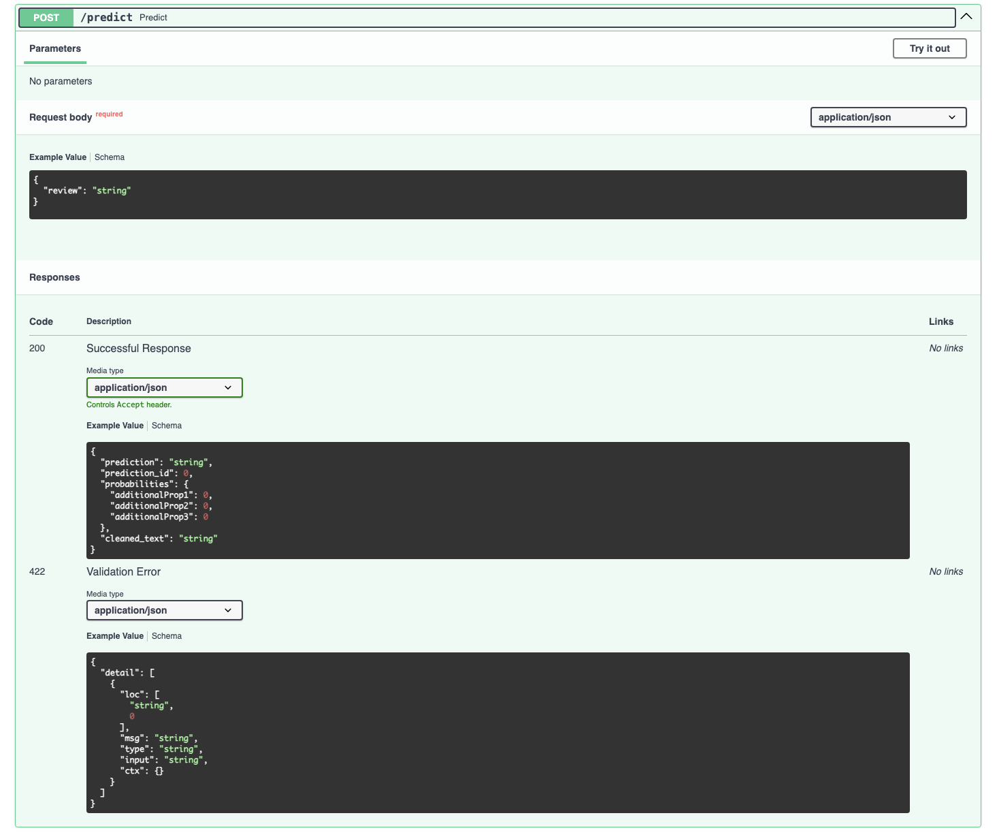
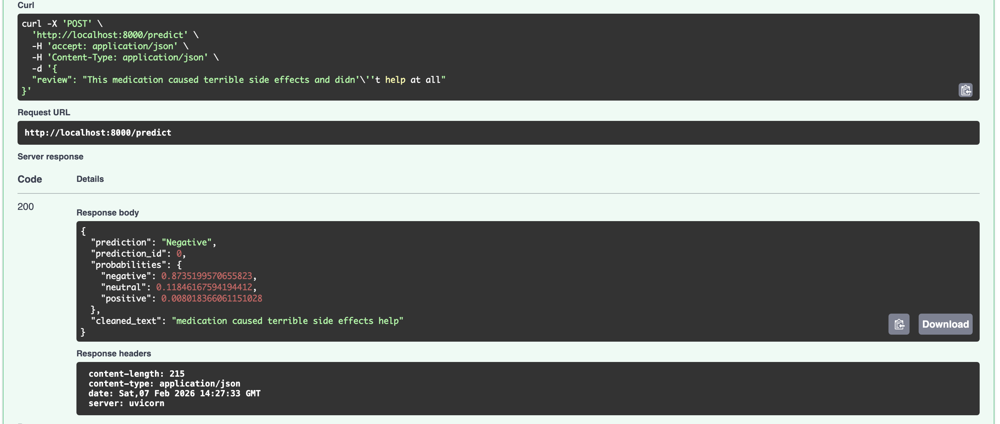
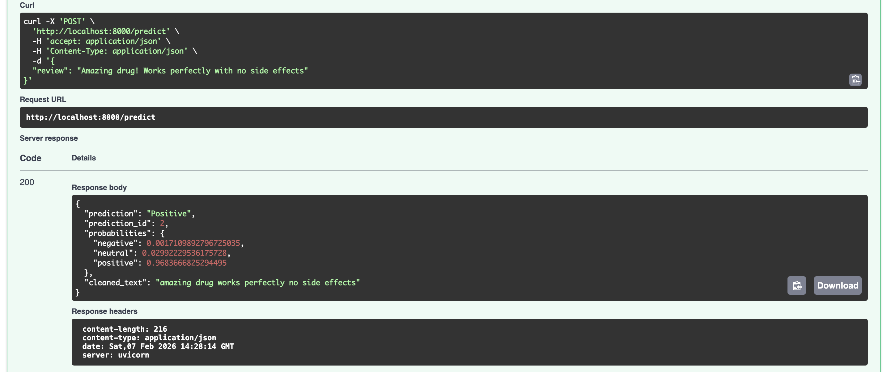

# Patient Sentiment Analysis API

A sentiment classification system for patient drug reviews, deployed as a REST API. Classifies reviews into Negative, Neutral, or Positive categories.


---

## Project Overview

This project classifies patient medication reviews into three sentiment categories based on their ratings:

| Category | Rating Range | Description |
|----------|--------------|-------------|
| Negative | 1-3 | Critical reviews, severe side effects |
| Neutral | 4-7 | Mixed experiences, moderate effectiveness |
| Positive | 8-10 | Highly effective, minimal side effects |

The final model achieves **73.5% accuracy** on 54k test samples with balanced performance across all classes.

---

## Results

### Model Performance

| Metric | Value |
|--------|-------|
| Test Accuracy | 73.5% |
| Training Samples | 86,472 (balanced) |
| Test Samples | 53,766 |
| Parameters | 352,643 |

### Class-Level Metrics

| Class | Precision | Recall | F1-Score | Support |
|-------|-----------|--------|----------|---------|
| Negative | 0.72 | 0.76 | 0.74 | 11,838 |
| Neutral | 0.42 | 0.61 | 0.49 | 9,579 |
| Positive | 0.90 | 0.76 | 0.83 | 32,349 |

The Neutral class remains challenging due to inherent ambiguity in ratings 4-7, but balanced training improved neutral recall from 28% to 61%.

---

## Technical Details

### Model Architecture

The model is a 2-layer LSTM that processes word sequences to capture context and word order:

- **Embeddings:** Word2Vec (Google News, 300 dimensions)
- **Sequence Length:** 50 words
- **Hidden Dimension:** 128
- **Dropout:** 0.3

### Design Decisions

1. **Balanced Training** - Stratified sampling (28,824 samples per class) significantly improved minority class performance
2. **Sequence Length Optimisation** - Reducing from 100 to 50 words improved accuracy by 12% by eliminating excessive zero-padding
3. **Negation Preservation** - Keeping words like "not", "never", "no" during preprocessing proved critical for sentiment accuracy

### Tech Stack

- **ML/DL:** PyTorch, scikit-learn, gensim
- **API:** FastAPI, Uvicorn
- **Deployment:** Docker
- **Data Processing:** pandas, numpy, NLTK

---

## Quick Start

### Prerequisites

- Python 3.10+
- Docker (optional)
- 2GB+ RAM (required for Word2Vec embeddings)

### Installation

Clone the repository:
```bash
git clone https://github.com/MalvinCY/patient-sentiment-classifier.git
cd patient-sentiment-classifier
```

Create and activate a virtual environment:
```bash
python -m venv venv
source venv/bin/activate  # On Windows: venv\Scripts\activate
```

Install dependencies:
```bash
pip install -r requirements.txt
```

Run the API:
```bash
cd api
python app.py
```

The API will start on `http://localhost:8000`

---

## API Usage

### Interactive Documentation

Visit `http://localhost:8000/docs` for Swagger UI with live testing:



### Prediction Endpoint

**Request:**
```bash
curl -X POST "http://localhost:8000/predict" \
  -H "Content-Type: application/json" \
  -d '{"review": "This medication caused terrible side effects"}'
```

**Response:**
```json
{
  "prediction": "Negative",
  "prediction_id": 0,
  "probabilities": {
    "negative": 0.87,
    "neutral": 0.12,
    "positive": 0.01
  },
  "cleaned_text": "medication caused terrible side effects"
}
```



### Python Example

```python
import requests

response = requests.post(
    "http://localhost:8000/predict",
    json={"review": "Amazing drug! Works perfectly with no side effects"}
)

result = response.json()
print(f"Sentiment: {result['prediction']}")
print(f"Confidence: {result['probabilities']['positive']:.2%}")
```



---

## Docker Deployment

Build and run with Docker:

```bash
docker build -t patient-sentiment-api .
docker run -p 8000:8000 patient-sentiment-api
```

### Cloud Deployment

**Important:** This application requires 2GB+ RAM due to Word2Vec embeddings (1.6GB).

Compatible platforms include AWS EC2 (t2.small or larger), Google Cloud Run with 2GB+ memory, and Render/Railway paid tiers. Free tier services typically have a 512MB limit which is insufficient.

Estimated hosting cost is around $7-15/month.

---

## Model Development

### Experiments

| Approach | Training Data | Accuracy | Notes |
|----------|---------------|----------|-------|
| Logistic Regression | 16k (imbalanced) | 58.9% | Baseline with averaged embeddings |
| LSTM (100-word pad) | 16k (imbalanced) | 58.5% | Excessive padding hurt performance |
| LSTM (50-word pad) | 16k (imbalanced) | 70.2% | Padding length was critical |
| LSTM (50-word pad) | 86k (balanced) | 73.5% | Final model |

Total improvement of 14.6 percentage points over baseline.

### Insights

- Padding length had a 12% impact on accuracy
- Balanced training improved performance more than architectural changes
- The neutral class is inherently difficult since ratings 4-7 contain mixed sentiment

---

## Project Structure

```
patient-sentiment-classifier/
├── api/
│   └── app.py                  # FastAPI application
├── data/
│   └── processed/              # Preprocessed embeddings
├── docs/
│   └── screenshots/            # API documentation images
├── models/
│   └── best_lstm_balanced.pth  # Trained model (Git LFS)
├── notebooks/
│   ├── 01_patient_sentiment_training.ipynb
│   └── 02_model_deployment_api.ipynb
├── Dockerfile
├── requirements.txt
├── .gitignore
└── README.md
```

---

## Methodology

### Data

The UCI Drug Review Dataset contains 215,063 reviews (161k train, 54k test). Preprocessing included HTML entity decoding, lowercase conversion, stop word removal (preserving negations), and special character removal.

### Training

- **Class Balancing:** Stratified sampling to 28,824 samples per class
- **Sequence Padding:** 50 words (covers 63% of reviews fully)
- **Optimisation:** Adam with lr=0.001 and early stopping
- **Regularisation:** Dropout at 0.3

---

## Future Improvements

Potential enhancements include:

- **Attention mechanisms** - Could improve accuracy to around 75% by learning which words matter most
- **Transformer models** - BERT or BioBERT could reach 76-77%, though they require GPU for fine-tuning
- **Ensemble methods** - Combining LSTM and Logistic Regression could add 1-2 percentage points

For production, the current LSTM offers a good balance of performance (73.5%), speed (50ms inference), and resource efficiency (runs on CPU).

---

## License

MIT License. See LICENSE file for details.

---

## Author

**Malvin Siew**

GitHub: [@MalvinCY](https://github.com/MalvinCY)

---

## Acknowledgements

- UCI Machine Learning Repository for the Drug Review Dataset
- Google News Word2Vec pre-trained embeddings
- FastAPI framework
